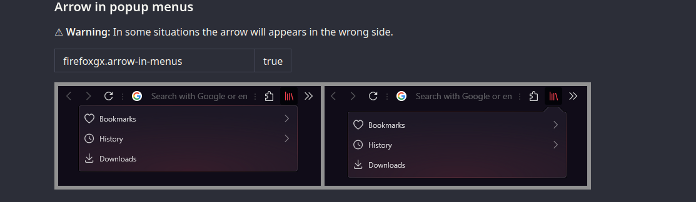

SIDEBERY CSS

# CSS backup and hacks for Firefox (usando em Linux (Debian 13 - Gnome)) 🦊

Esse CSS deve ser usado com a config oneline> [ONELINE](https://github.com/Godiesc/firefox-gx/tree/main/Extras/OneLine)

Alguns hacks usados:

'Expand on hover' 

----------------
# My-firefox-configs

